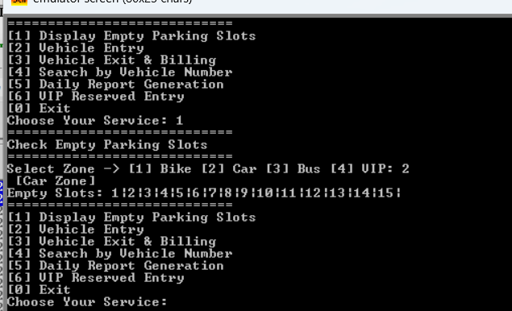

# Smart Parking System

A console-based **Smart Parking System** implemented using **procedures and arrays** in Assembly Language.  
**No stack and no macros** are used.

---

---

## Contributors

- **Al-Amin Sagor**  
  - Display Parking Slots Status with type of vehicle zone  
  - Search Vehicle by Number

- **Saidul Islam Apu**  
  - Vehicle Entry Registration with type-based slot control  
  - Vehicle Exit & Billing

- **Nur Mohsin**  
  - Daily Report Generation  
  - Reserved Slots for VIP

---

## Features

### 1. Display Parking Slots Status (Al-Amin Sagor)
- Shows which slots are **empty (0)** and which are **occupied (1)**.
- Slots are categorized by **vehicle type**:
  - Bike = 1
  - Car = 2
  - Bus = 3
- Uses an **array** to store the status of each parking slot.

---

### 2. Vehicle Entry Registration (Saidul Islam Apu)
- Inputs vehicle number.
- Assigns the **nearest empty slot** for the given vehicle type.
- Automatically **blocks entry** for a type if its slots are full.
- Updates the **array** to mark the slot as occupied.

---

### 3. Vehicle Exit & Billing (Saidul Islam Apu)
- Input **slot number** to free it.
- Calculates **parking fee** based on hours stayed using a **procedure**.
- Billing Rules:
  - **5 Taka per hour**.
  - **Discount**: Flat 10 Taka discount if parking ≥ 5 hours.
  - Examples:
    - 1 hour → 5 Taka  
    - 2 hours → 10 Taka  
    - 5 hours → 15 Taka (5*5 - 10 discount)

---

### 4. Search Vehicle by Number (Al-Amin Sagor)
- Search the **array** for a given vehicle number.
- Displays the **slot number** of the vehicle.

---

### 5. Daily Report Generation (Nur Mohsin)
- Displays:
  - Total vehicles parked
  - Total earnings
  - Remaining empty slots

---

### 6. Reserved Slots for VIP (Nur Mohsin)
- Certain slots are **reserved for VIPs**.
- Access requires **PIN code verification**.
- PINs are stored in **arrays** and matched against user input.

---

## Notes
- Implemented using **procedures** and **arrays** only.
- No use of **stack operations** or **macros**.
- Compatible with `.asm` files (MASM/NASM/TASM).  
- Designed for **x86 Assembly language**, but logic can be adapted for other assemblers.
